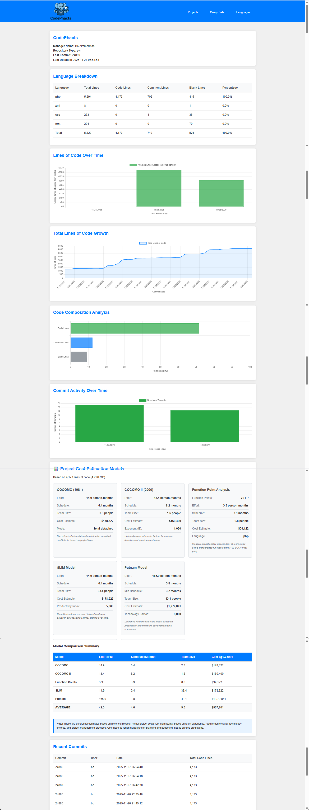

# CodePhacts

A source code statistics and project estimation web app that tracks lines of code, languages, 
commits, contributors, and generates fun cost estimates across multiple programming languages.

## Overview

CodePhacts is a PHP-based web application that analyzes source code repositories (Git and SVN), 
tracks code statistics over time, and provides detailed estimations using five different 
cost models: COCOMO, COCOMO II, Function Point Analysis, SLIM, and Putnam.

### Key Features

- **Multi-Language Support**: Analyzes 30+ programming languages including Java, C/C++, Python, JavaScript, PHP, Assembly, and more
- **Repository Integration**: Direct integration with Git and SVN repositories
- **Historical Tracking**: Tracks code evolution through commits and code lines over time
- **Cost Estimation Models**: Five estimation models with comparative analysis
- **Visual Analytics**: Interactive charts showing code growth, composition, and commit activity
- **Project Management**: Multi-project support with individual statistics and reporting
- **Flexible Exclusions**: Configurable directory exclusions (e.g., `node_modules`, `vendor`)



## Installation

### Prerequisites

- PHP 7.4 or higher
- Git and/or SVN command-line tools (depending on your repositories)
- Web server (Caddy, Apache, Nginx, or similar)

### Setup Steps

1. **Clone or download** the CodePhacts repository to your web server directory

2. **Configure the application** by editing `conphig.php`:
```php
   return [
       // IMPORTANT: Change this password immediately!
       'admin_password' => 'put-your-admin-password-here---this-is-not-the-default',
       
      'db' => [
        'type'     => 'sqlite', // sqlite or mysql
        'host'     => 'localhost',        // MySQL host
        'port'     => 3306,               // Optional: MySQL port
        'name'     => 'codephacts',      // Database name
        'user'     => 'root',           // DB username
        'pass'     => 'secretpassword',   // DB password
        'charset'  => 'utf8',          // Recommended charset
        'path'     => __DIR__ . DIRECTORY_SEPARATOR . 'data' . DIRECTORY_SEPARATOR . 'codephacts.db', // sql lite path
      ],
       
       // How long to wait (in seconds) before reprocessing a commit
       'stale_timeout' => 1000,
       
         // Languages to not count as 'code' for 'Code Line' counting.
        "not_code_lines" => ["text", "xml", "json", "css", "html", "properties"],
        
         // Languages to not count as 'code' for 'Code Statement' counting.
        "not_code_statements" => [],
       
       'tables' => [
           'projects'   => 'projects',
           'statistics' => 'statistics',
           'commits'    => 'commits'
       ]
   ];
```

3. **Set proper permissions**:
```bash
   chmod 755 admin/
   chmod 755 public/
   chmod 644 conphig.php
```

4. **Configure your web server** to point to the CodePhacts directory. The application entry point is `index.php`, which redirects to `public/index.php`.

5. **Verify Git/SVN access**: Ensure your web server user has network access and credentials (if needed) to clone/checkout your repositories.

## Configuration

### Admin Password

**CRITICAL**: Change the default admin password in `conphig.php` before deploying:
```php
'admin_password' => 'YourSecurePasswordHere123!',
```

### Database Configuration

Update the database credentials in `conphig.php`:
```php
    'db' => [
        'type'     => 'sqlite', // sqlite or mysql
        'host'     => 'localhost',        // MySQL host
        'port'     => 3306,               // Optional: MySQL port
        'name'     => 'codephacts',      // Database name
        'user'     => 'root',           // DB username
        'pass'     => 'secretpassword',   // DB password
        'charset'  => 'utf8',          // Recommended charset
        'path'     => __DIR__ . DIRECTORY_SEPARATOR . 'data' . DIRECTORY_SEPARATOR . 'codephacts.db', // sql lite path
    ],
```

### Stale Timeout

The `stale_timeout` setting (in seconds) determines how long before a previously-processed commit can be reprocessed.:
```php
'stale_timeout' => 1000,
```

### Not Code

The `not_code_lines` setting is a list of languages (see the rules directory) that do not have their lines counted
as "Code Lines".  They will still be counted as "Total Lines".
```php
"not_code_lines" => ["text", "xml", "json", "css", "html", "properties"],
```

The `not_code_statements` setting is a list of languages (see the rules directory) that do not have their statements
counted as "Code Statements".
```php
"not_code_statements" => [],
```

## Usage

### Accessing the Application

1. **Public Interface**: Navigate to `http://your-domain.com/public/` to view projects and statistics
2. **Admin Interface**: Navigate to `http://your-domain.com/admin/index.php` and log in with your configured password

### Adding Projects

1. Log into the admin panel
2. Click **"Manage Projects"**
3. Click **"Add New Project"**
4. Fill in the form:
   - **Project Name**: A descriptive name
   - **Source Type**: Git or SVN
   - **Repository URL**: Full URL to the repository (e.g., `https://github.com/user/repo.git`)
   - **Excluded Directories**: Comma-separated paths to exclude (e.g., `/vendor,/node_modules,/build`)
   - **Manager**: Optional project manager name
5. Click **"Add Project"**

### Running Updates

CodePhacts processes commits through the `phactor.php` script. There are two ways to run updates:

#### Via Admin Interface

1. Log into admin panel
2. Click **"Dashboard"** → **"Run Update"**
3. Monitor and wait for completion

#### Via Command Line (Recommended for Cron)
```bash
php /path/to/codephacts/phactor.php
```

**Set up automated updates** with a cron job:
```bash
# Run every hour
0 * * * * cd /path/to/codephacts && php phactor.php >> /var/log/codephacts.log 2>&1
```

### Viewing Statistics

#### Project View
- Click any project name to see detailed statistics
- View language breakdown, code composition, commit history
- See all five cost estimation models with comparative analysis

#### Languages View
- Click **"Languages"** in the navigation
- View portfolio-wide statistics aggregated by programming language
- See cumulative cost estimates across all projects

#### Query Data
- Click **"Query Data"** to filter statistics
- Select multiple projects and/or languages
- Apply date ranges for historical analysis
- Export results for reporting

## Cost Estimation Models

CodePhacts provides five cost estimation models:

### 1. COCOMO (1981)
Barry Boehm's Constructive Cost Model using empirical coefficients based on project complexity (organic, semi-detached, embedded).

### 2. COCOMO II (2000)
Updated model incorporating scale factors for modern development practices, reuse, and team dynamics.

### 3. Function Point Analysis
Technology-independent functional measurement converting LOC to function points based on language-specific ratios.

### 4. SLIM Model
Software Lifecycle Management model using Rayleigh curves emphasizing optimal resource allocation over time.

### 5. Putnam Model
Lifecycle prediction model based on the software equation with technology factors and minimum development time constraints.

Each model provides:
- **Effort** (person-months)
- **Schedule** (months)
- **Team Size** (average people)
- **Cost Estimate** (at $75/hour by default)

## Supported Languages

CodePhacts analyzes 30+ programming languages:

**Compiled**: C, C++, C#, Java, Kotlin, Rust, Go, Swift, Scala, Dart  
**Scripting**: PHP, Python, JavaScript, TypeScript, Ruby, Shell, Batch  
**Assembly**: x86, ARM, 6502, and other assembly dialects  
**Markup**: HTML, XML, CSS, JSON  
**Legacy**: BASIC, Visual Basic
**Configuration**: Properties, INI files  
**Specialized**: QuestMaker scripts, MobProg scripts

## Directory Structure
```
codephacts/
├── admin/              # Admin panel files
│   ├── auth.php        # Authentication handler
│   ├── edit-project.php # Project editor
│   ├── index.php       # Admin dashboard
│   ├── login.php       # Login page
│   ├── logout.php      # Logout page
│   ├── projects.php    # Project management
│   └── run-update.php  # Manual update viewer
├── public/             # Public-facing pages
│   ├── contributors.php# Contributors page
│   ├── index.php       # Project listing
│   ├── languages.php   # Language statistics
│   ├── project.php     # Individual project view
│   ├── query.php       # Data query interface
│   └── style.css       # Stylesheet
├── rules/              # Language analysis rules
│   ├── c.php
│   ├── java.php
│   ├── python.php
│   └── ...
├── images/             # Logo and assets
├── conphig.php          # Configuration file
├── phactor.php         # Main processing script
├── schema.sql          # Database schema
└── index.php           # Entry point (redirects to public/)
```

## Security Considerations

1. **Change the default admin password** immediately in `conphig.php`
2. Protect `conphig.php` from web access (use `.htaccess` or server config)
3. Run `phactor.php` via command line with appropriate system user permissions
4. Use HTTPS in production environments
5. Restrict database user permissions to only the `codephacts` database
6. Consider IP restrictions for the admin panel in production

## Troubleshooting

### "Cannot access repository" errors
- Verify Git/SVN is installed and in PATH
- Check repository URL is correct and accessible
- Ensure web server user has network access
- For private repos, configure SSH keys or credentials

### "Database error" messages
- Verify database credentials in `conphig.php`
- Ensure MySQL/MariaDB is running
- Check that the `codephacts` database exists
- Verify user has appropriate permissions

### Updates hang or timeout
- Increase PHP `max_execution_time` in php.ini for large repositories
- Run `phactor.php` from command line instead of web interface
- Check system resources (disk space, memory)
- Review excluded directories to skip large folders

### Missing statistics
- Ensure the file extension is supported (check `rules/` directory)
- Verify files aren't in excluded directories
- Check for proper commit processing in the database

## License

Copyright 2025 Bo Zimmerman

Licensed under the Apache License, Version 2.0 (the "License");
you may not use this file except in compliance with the License.
You may obtain a copy of the License at

    http://www.apache.org/licenses/LICENSE-2.0

Unless required by applicable law or agreed to in writing, software
distributed under the License is distributed on an "AS IS" BASIS,
WITHOUT WARRANTIES OR CONDITIONS OF ANY KIND, either express or implied.
See the License for the specific language governing permissions and
limitations under the License.

## Contributing

To add support for additional programming languages:

1. Create a new rule file in `rules/` directory (e.g., `rules/mylang.php`)
2. Follow the existing rule file structure with `extensions`, `language`, and `analyzer` keys
3. Implement optional `detector` function for multi-language file detection
4. Test with sample code in your language

## Support

For issues, questions, or contributions, please contact the project maintainer.